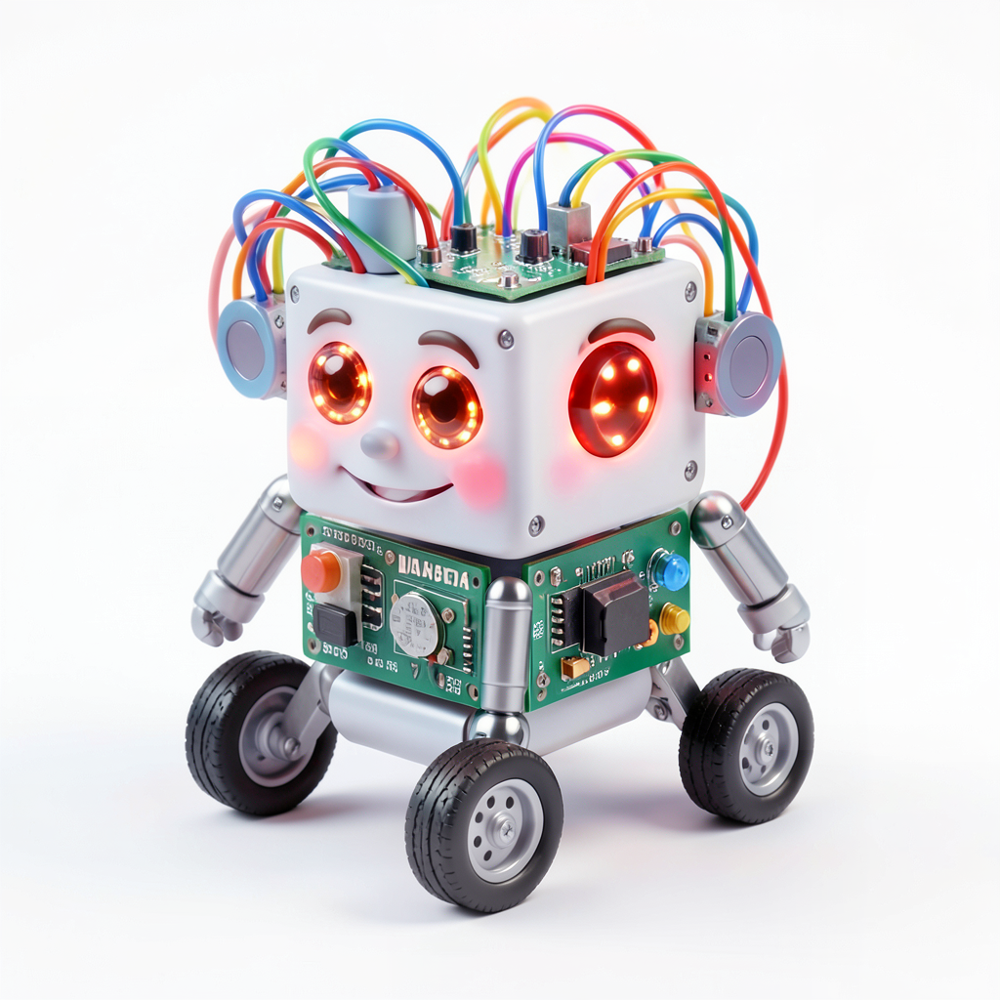
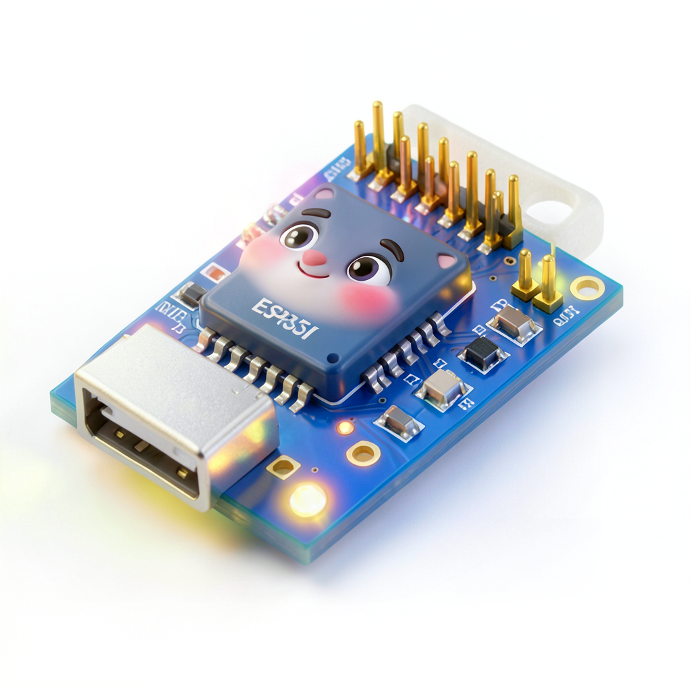
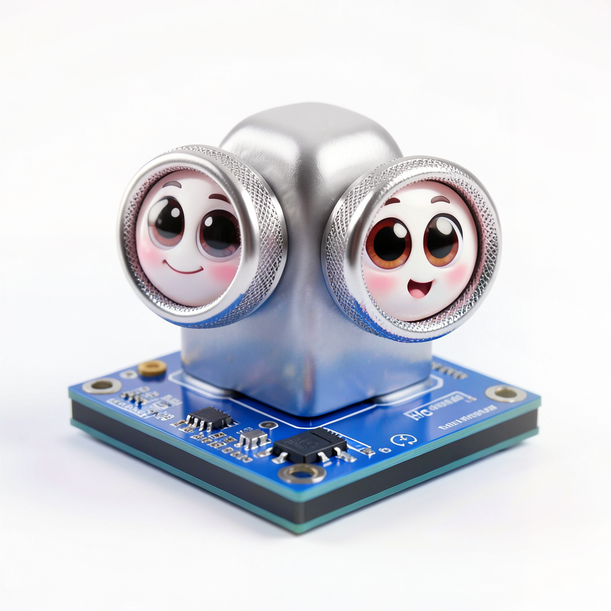
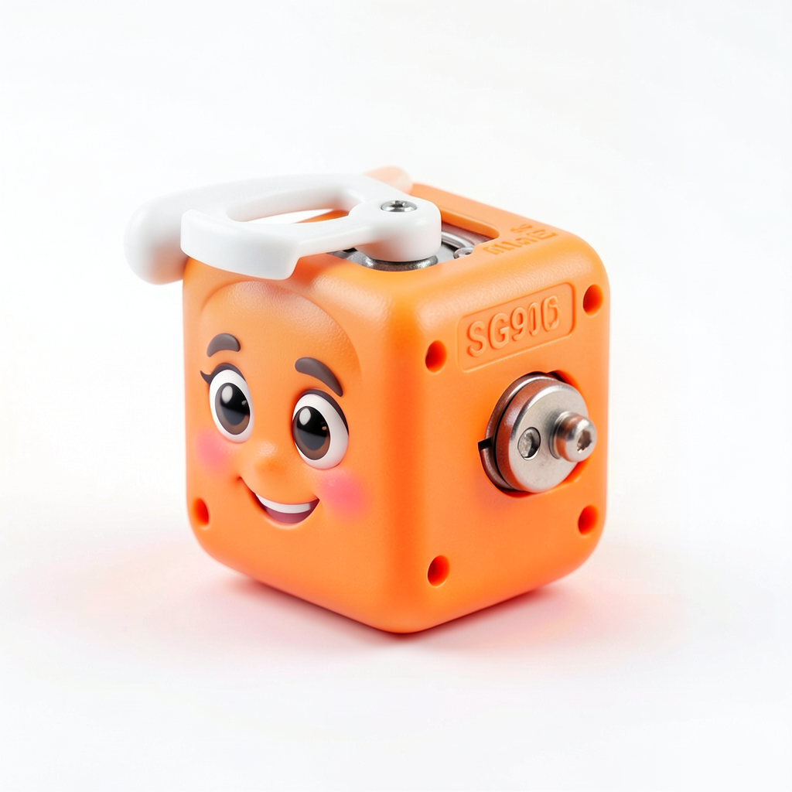

# Maestría del Arquitecto de Aprendizaje {.unnumbered}

## El Framework de Ingeniería Educativa {.unnumbered}

:::: {.columns}

::: {.column width="60%"}
### "No estamos aquí para enseñar sintaxis; estamos aquí para diseñar sistemas." {.unnumbered}

Bienvenido a la ruta de excelencia en MicroPython. Este curso es un despliegue de ingeniería diseñado para convertirte en el **Arquitecto Principal** de tu aula.
:::

::: {.column width="40%"}
::: center
{width="100%"}
:::
:::

::::

---

## Ecosistema de Ingeniería

::: {layout-ncol=3}

:::

---

::: {.callout-note}
## Declaración de Propósitos
Este framework de aprendizaje ha sido diseñado para transformar la enseñanza de la tecnología desde un enfoque puramente descriptivo hacia una **Ingeniería Pedagógica** de alto rendimiento.
:::

---

::: {.callout-tip}
## ¿Cómo abordamos este proyecto? (Filosofía Statick)

| Acción | Rol | Objetivo |
|-----------|-------|--------|
| **Diseño** | Tú | Planificar la arquitectura de la clase. |
| **Implementación** | Nosotros | Desplegar el código en hardware real. |
| **Validación** | Ambos | Asegurar que el aprendizaje ha sido exitoso. |
:::

---

## El Ecosistema de Desarrollo

| Componente | Especificación Técnica |
|------------|---------|
| **Core** | LEGO SPIKE Prime Hub |
| **Plataforma** | Pybricks (MicroPython Optimizado) |
| **Entorno** | Stark/Statick Console (code.pybricks.com) |
| **Interface** | Protocolo de conexión segura (USB/BT) |

---

## Roadmap del Arquitecto

| Fase | Despliegue de Sistemas | Milestone |
|--------|------|---------|
| **Fase 0** | El Manifiesto y las Competencias | 📋 Certificación Base |
| **Fase 1** | Configuración de Infraestructura | 🔌 Conexión Estable |
| **Fase 2** | Control Visual y HUD | 💡 Feedback Visual |
| **Fase 3** | Lógica de Tracción y Actuación | ⚙️ Movimiento Preciso |
| **Fase 4** | Telemetría y Percepción de Datos | 📡 Telemetría Avanzada |
| **Fase 5** | Despliegue de la IA JARVIS (Proyecto) | 🏆 Maestría Final |

---

*Diseñado bajo los estándares de Arquitectura del Aprendizaje - Diego Saavedra 2026*
